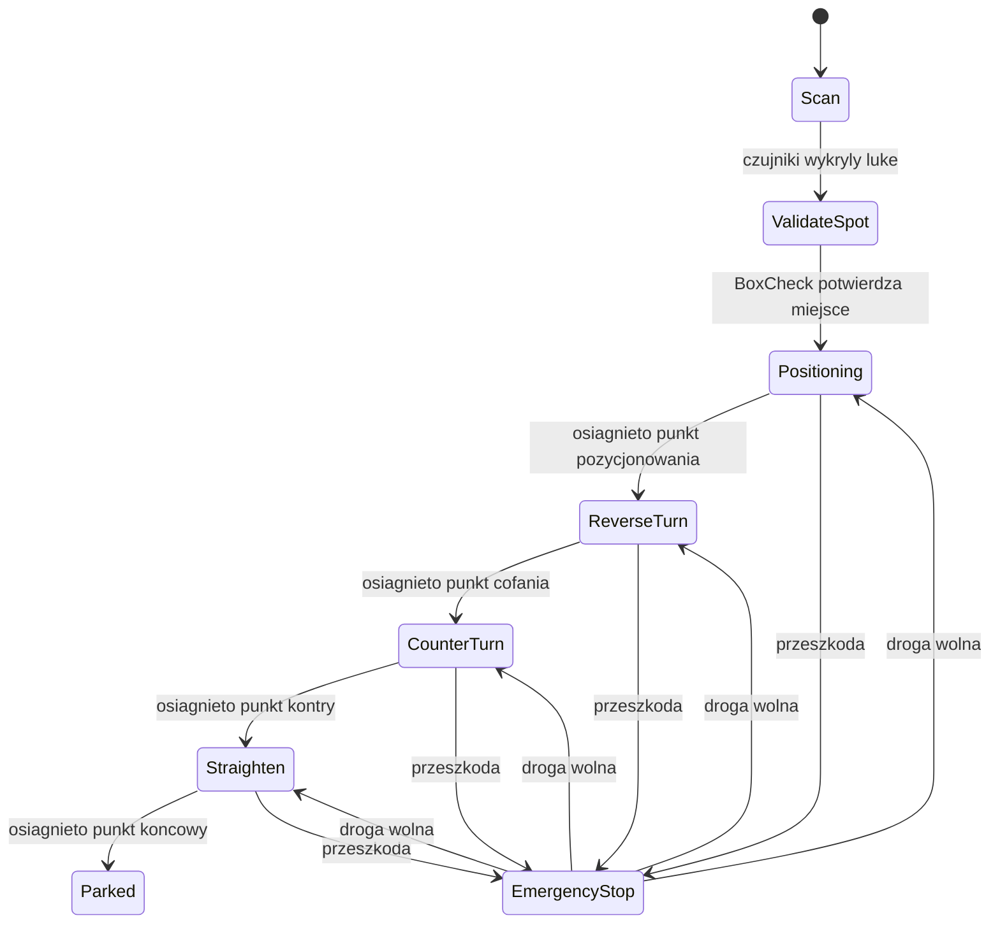

# Automatyczne parkowanie w Unity 3D

Projekt: deterministyczny algorytm automatycznego parkowania bez machine learningu.

## Metryczka zespolu

Projekt: Automatyczne parkowanie w Unity 3D  
Repozytorium: https://github.com/Skkpl/Final-Unity-Parkowanie.git  
Data przygotowania dokumentacji: 2026-06-16  

| Osoba | Nr albumu | Udzial | Zakres odpowiedzialnosci |
| --- | ---: | ---: | --- |
| Szymon Karamon | 91859 | 40% | Integracja projektu w Unity, generator scen, konfiguracja repozytorium GitHub, testy koncowe, dokumentacja oddania. |
| Bartosz Stolarczyk | 91742 | 30% | Logika automatu FSM, sensory Raycast/CheckBox, HUD debug, testy wykrywania miejsc parkingowych. |
| Antoni Krakowiak | 88437 | 30% | Przygotowanie ukladu map, trajektorie manewrow parkowania, ruch przeszkody dynamicznej, korekty wizualne pojazdow. |

Oswiadczenie o zakresie prac: powyzszy podzial opisuje deklarowany wklad osob w przygotowanie projektu, dokumentacji i scen demonstracyjnych. Kod sterowania, sceny i dokumentacja stanowia wspolny rezultat zespolu.

## Co zawiera projekt

- Prosty model auta sterowany kinematycznie.
- Proste modele aut z nadwoziem, kabina i kolami zamiast pojedynczych kostek.
- Wizualna fizyka kol: kola obracaja sie podczas jazdy, a przednie kola skrecaja zgodnie z kierunkiem manewru.
- Czujniki wirtualne oparte o `Physics.Raycast` oraz walidacje wolnej przestrzeni przez `Physics.CheckBox`.
- Punkty trajektorii `ParkingScenario`, dzieki ktorym manewr jest powtarzalny na kazdej mapie.
- Tryb demonstracyjny "po szynach": po wykryciu miejsca auto jedzie po wczesniej wyznaczonych punktach, z ograniczona zmiana kata miedzy punktami.
- Maszyne stanow FSM:
  `Scan -> ValidateSpot -> Positioning -> ReverseTurn -> CounterTurn -> Straighten -> Parked`.
- Stan awaryjny `EmergencyStop`, ktory zatrzymuje auto przy przeszkodzie przed lub za pojazdem.
- Trzy sceny testowe:
  - `Map_01_Perpendicular` - parking prostopadly z falszywa luka.
  - `Map_02_Parallel` - waska ulica i parkowanie rownolegle.
  - `Map_03_Dynamic` - uklad jak mapa 1, ale miejsca sa po lewej stronie; auto z naprzeciwka wymusza zatrzymanie.
- UI do przechodzenia miedzy mapami, w tym zapasowe przyciski `OnGUI`.
- HUD debug pokazujacy stan FSM, predkosc i odczyty czujnikow.
- README pelni role glownej dokumentacji technicznej i organizacyjnej projektu.

## Zgodnosc z wymaganiami oddania

- Repozytorium zawiera kod zrodlowy, README oraz plik `.gitignore` przygotowany pod Unity.
- Historia Git zawiera commit poczatkowy oraz kolejne commity porzadkujace dokumentacje i metryczke projektu.
- Projekt nie korzysta z ML-Agents ani z gotowego modelu `.onnx`; logika jest napisana jako deterministyczny FSM.
- README zawiera opis decyzji projektowych, diagram FSM, instrukcje uruchomienia, test plan i znane ograniczenia.
- Film z demonstracja oraz build `.exe` nalezy przygotowac osobno po otwarciu projektu w Unity.

## Diagram FSM

## Decyzje projektowe

Algorytm demonstracyjny nie korzysta z machine learningu. Auto jedzie wzdluz pasa, pokazuje odczyty czujnikow bocznych i po dojechaniu do zaakceptowanej luki przechodzi do kolejnych stanow FSM. Dla niezawodnosci prezentacji manewr parkowania jest wykonywany po punktach trajektorii wygenerowanych w scenie.

Na mapie 1 wszystkie miejsca sa zajete poza dwoma: pierwsza wolna luka jest za waska przez zle ustawione sasiednie pojazdy, a druga wolna luka jest miejscem docelowym. Auto przejezdza obok za waskiej luki i parkuje dopiero w miejscu docelowym. Na mapie 2 luka ma wiekszy zapas z przodu, zeby manewr rownolegly nie zahaczal o auto przed miejscem. Na mapie 3 miejsca parkingowe sa po lewej stronie jak w mapie 1. Czerwone auto jedzie z naprzeciwka, niebieskie czeka, az przejedzie, potem dojezdza do lewej krawedzi drogi i gladko cofa w miejsce.

Sterowanie autem jest uproszczonym modelem kinematycznym. Po znalezieniu miejsca projekt celowo przechodzi w tryb "po szynach", zeby pokaz byl stabilny i powtarzalny:

- predkosc zmienia sie plynnie przez przyspieszenie i hamowanie,
- skret jest ograniczony do 35 stopni,
- kat skretu zmienia sie w czasie, a nie natychmiastowo,
- obrot pojazdu jest wyliczany z uproszczonego modelu rowerowego.
- w trybie demonstracyjnym po wykryciu miejsca auto sledzi sztywne odcinki trajektorii podzielone na male kroki,
- orientacja nadwozia jest liczona tylko po osi pionowej Y i interpolowana miedzy kolejnymi punktami najkrotsza droga, dlatego nie moze wykonac obrotu 360 stopni,
- etap konczy sie po przejechaniu calego odcinka szyny, bez dokrecania pojazdu w miejscu.

## Uwagi o fizyce

Sprawdzono oficjalne `WheelCollider` Unity. To dobre narzedzie do pojazdow, ale wymaga strojenia zawieszenia, tarcia, masy i kolizji pod konkretna scene. W projekcie zostal zastosowany stabilny model kinematyczny inspirowany kinematic bicycle / path tracking. Dla niezawodnosci zaliczeniowej finalny manewr parkowania dziala jak pojazd jadacy po wyznaczonej szynie: kola wizualnie skrecaja i obracaja sie, ale tor jest deterministyczny i nie korzysta z losowej dynamiki Rigidbody.

## Instrukcja uruchomienia

1. Skopiuj folder `Assets` z tej paczki do glownego folderu projektu Unity.
2. Wroc do Unity i poczekaj az skrypty sie skompiluja.
3. Wybierz z menu Unity: `Tools -> Parking Project -> Build Demo Scenes`.
4. Otworz scene `Assets/Scenes/MainMenu.unity`.
5. Uruchom Play i wybierz jedna z trzech map.

## Mapa plikow

| Plik | Rola |
| --- | --- |
| `Assets/Editor/ParkingDemoBuilder.cs` | Buduje materialy, prefab auta, UI i trzy sceny testowe. |
| `Assets/Scripts/Parking/ParkingTypes.cs` | Definicje stanow FSM, typu parkowania, sensorow i kandydata miejsca. |
| `Assets/Scripts/Parking/ParkingCarController.cs` | Uproszczona kinematyka auta oraz sledzenie punktow manewru. |
| `Assets/Scripts/Parking/ParkingSensors.cs` | Czujniki `Raycast`, odczyty odleglosci i walidacja miejsca przez `CheckBox`. |
| `Assets/Scripts/Parking/ParkingStateMachine.cs` | Glowny automat stanow: skanowanie, walidacja, manewr, stop awaryjny. |
| `Assets/Scripts/Parking/ParkingScenario.cs` | Dane scenariusza: punkty wykrycia miejsca i trajektorie parkowania. |
| `Assets/Scripts/Parking/MovingObstacle.cs` | Ruch czerwonego auta w scenie dynamicznej. |
| `Assets/Scripts/Parking/VehicleVisualRig.cs` | Wizualny obrot kol i skret przednich kol. |
| `Assets/Scripts/Parking/DebugHud.cs` | HUD debug w lewym gornym rogu. |
| `Assets/Scripts/Parking/MapManager.cs` | Ladowanie map i restart. |

## Test plan

- Mapa 1: auto pomija za waska luke i parkuje w poprawnym miejscu prostopadlym.
- Mapa 2: auto wykonuje parkowanie rownolegle tylem i konczy w stanie `Parked`.
- Mapa 3: czerwone auto jedzie z naprzeciwka, niebieskie auto zatrzymuje sie, czeka, a potem parkuje po lewej stronie.
- UI: przyciski `Map 1`, `Map 2`, `Map 3`, `Menu` i `Restart` zmieniaja sceny.
- Debug: w Scene View widac promienie `Debug.DrawRay`, a HUD pokazuje stan FSM i sensory.

## Build

Po wygenerowaniu scen wejdz w `File -> Build Profiles` albo `File -> Build Settings`.
Sceny zostana dodane automatycznie przez generator:

1. `MainMenu`
2. `Map_01_Perpendicular`
3. `Map_02_Parallel`
4. `Map_03_Dynamic`

Zbuduj wersje Windows `.exe`.

## Znane problemy

- To jest wersja minimum zaliczeniowa, a nie algorytm konkursowy.
- Manewr parkowania korzysta z punktow `ParkingScenario`, wiec przy duzej zmianie wymiarow sceny trzeba dostroic te punkty.
- Fizyka jest uproszczona i nie korzysta z pelnego modelu WheelCollider.
- Auto moze przejechac przez przeszkode, jesli czujnik awaryjny zostanie zle ustawiony albo obiekt nie ma collidera.
- Mapy sa przygotowane tak, aby dobrze demonstrowac sensory, FSM i reakcje na przeszkode.

## Co pokazac na filmie

- Menu z trzema mapami.
- Na mapie 1: ominiecie za waskiej luki i zaparkowanie w drugiej wolnej luce.
- Na mapie 2: odrzucenie za krotkiej luki i parkowanie rownolegle.
- Na mapie 3: miejsca po lewej, czerwone auto jedzie z naprzeciwka, nasze auto czeka, potem podjezdza do lewej krawedzi i cofa w miejsce.
- Przez chwile pokazac Scene View, aby bylo widac zielone/czerwone promienie `Debug.DrawRay`.
