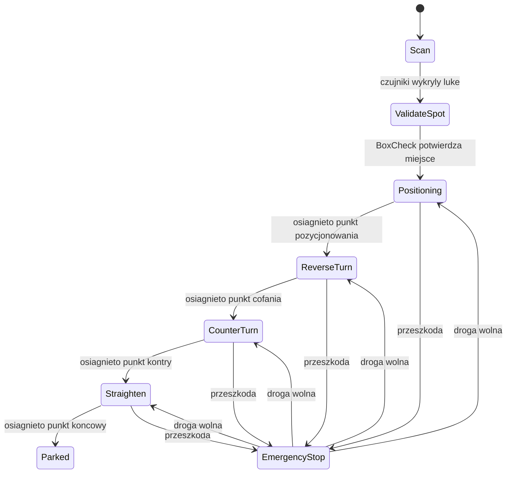

# Automatyczne parkowanie w Unity 3D

Projekt: deterministyczny algorytm automatycznego parkowania bez machine learningu.

## Autor

Imie i nazwisko: wpisz swoje dane  
Numer albumu: wpisz numer albumu  
Data: 2026-06-15  
Udzial: 100% - projekt indywidualny

## Co zawiera projekt

- Prosty model auta sterowany kinematycznie.
- Proste modele aut z nadwoziem, kabina i kolami zamiast pojedynczych kostek.
- Wizualna fizyka kol: kola obracaja sie podczas jazdy, a przednie kola skrecaja zgodnie z kierunkiem manewru.
- Czujniki wirtualne oparte o `Physics.Raycast` oraz walidacje wolnej przestrzeni przez `Physics.CheckBox`.
- Punkty trajektorii `ParkingScenario`, dzieki ktorym manewr jest powtarzalny na kazdej mapie.
- Tryb demonstracyjny "po szynach": po wykryciu miejsca auto jedzie po wczesniej wyznaczonych punktach, z ograniczona zmiana kata miedzy punktami.
- Maszyne stanow FSM:
  `Scan -> ValidateSpot -> Positioning -> ReverseTurn -> CounterTurn -> Straighten -> Parked`.
- Stan awaryjny `EmergencyStop`, ktory zatrzymuje auto przy przeszkodzie przed lub za pojazdem.
- Trzy sceny testowe:
  - `Map_01_Perpendicular` - parking prostopadly z falszywa luka.
  - `Map_02_Parallel` - waska ulica i parkowanie rownolegle.
  - `Map_03_Dynamic` - uklad jak mapa 1, ale miejsca sa po lewej stronie; auto z naprzeciwka wymusza zatrzymanie.
- UI do przechodzenia miedzy mapami, w tym zapasowe przyciski `OnGUI`.
- HUD debug pokazujacy stan FSM, predkosc i odczyty czujnikow.
- Folder `Documentation` z pelnym opisem technicznym, instrukcja stworzenia projektu od zera, testami i sciaga do obrony.

## Dokumentacja

W folderze `Documentation` sa osobne pliki:

1. `01_Dokumentacja_techniczna.md` - dokladny opis architektury, klas, FSM, sensorow, map i generatora scen.
2. `02_Jak_stworzyc_od_zera.md` - instrukcja jak zbudowac podobny projekt samodzielnie w Unity.
3. `03_Testy_i_uruchomienie.md` - test plan, kryteria zaliczenia i typowe problemy.
4. `04_Opis_do_obrony.md` - krotka sciaga do odpowiedzi przed prowadzacym.
5. `05_Mapa_plikow_i_parametrow.md` - gdzie w kodzie zmieniac predkosci, sensory, tory parkowania i UI.

## Diagram FSM

## Decyzje projektowe

Algorytm demonstracyjny nie korzysta z machine learningu. Auto jedzie wzdluz pasa, pokazuje odczyty czujnikow bocznych i po dojechaniu do zaakceptowanej luki przechodzi do kolejnych stanow FSM. Dla niezawodnosci prezentacji manewr parkowania jest wykonywany po punktach trajektorii wygenerowanych w scenie.

Na mapie 1 wszystkie miejsca sa zajete poza dwoma: pierwsza wolna luka jest za waska przez zle ustawione sasiednie pojazdy, a druga wolna luka jest miejscem docelowym. Auto przejezdza obok za waskiej luki i parkuje dopiero w miejscu docelowym. Na mapie 2 luka ma wiekszy zapas z przodu, zeby manewr rownolegly nie zahaczal o auto przed miejscem. Na mapie 3 miejsca parkingowe sa po lewej stronie jak w mapie 1. Czerwone auto jedzie z naprzeciwka, niebieskie czeka, az przejedzie, potem dojezdza do lewej krawedzi drogi i gladko cofa w miejsce.

Sterowanie autem jest uproszczonym modelem kinematycznym. Po znalezieniu miejsca projekt celowo przechodzi w tryb "po szynach", zeby pokaz byl stabilny i powtarzalny:

- predkosc zmienia sie plynnie przez przyspieszenie i hamowanie,
- skret jest ograniczony do 35 stopni,
- kat skretu zmienia sie w czasie, a nie natychmiastowo,
- obrot pojazdu jest wyliczany z uproszczonego modelu rowerowego.
- w trybie demonstracyjnym po wykryciu miejsca auto sledzi sztywne odcinki trajektorii podzielone na male kroki,
- orientacja nadwozia jest liczona tylko po osi pionowej Y i interpolowana miedzy kolejnymi punktami najkrotsza droga, dlatego nie moze wykonac obrotu 360 stopni,
- etap konczy sie po przejechaniu calego odcinka szyny, bez dokrecania pojazdu w miejscu.

## Uwagi o fizyce

Sprawdzono oficjalne `WheelCollider` Unity. To dobre narzedzie do pojazdow, ale wymaga strojenia zawieszenia, tarcia, masy i kolizji pod konkretna scene. W projekcie zostal zastosowany stabilny model kinematyczny inspirowany kinematic bicycle / path tracking. Dla niezawodnosci zaliczeniowej finalny manewr parkowania dziala jak pojazd jadacy po wyznaczonej szynie: kola wizualnie skrecaja i obracaja sie, ale tor jest deterministyczny i nie korzysta z losowej dynamiki Rigidbody.

## Instrukcja uruchomienia

1. Skopiuj folder `Assets` z tej paczki do glownego folderu projektu Unity.
2. Wroc do Unity i poczekaj az skrypty sie skompiluja.
3. Wybierz z menu Unity: `Tools -> Parking Project -> Build Demo Scenes`.
4. Otworz scene `Assets/Scenes/MainMenu.unity`.
5. Uruchom Play i wybierz jedna z trzech map.

## Build

Po wygenerowaniu scen wejdz w `File -> Build Profiles` albo `File -> Build Settings`.
Sceny zostana dodane automatycznie przez generator:

1. `MainMenu`
2. `Map_01_Perpendicular`
3. `Map_02_Parallel`
4. `Map_03_Dynamic`

Zbuduj wersje Windows `.exe`.

## Znane problemy

- To jest wersja minimum zaliczeniowa, a nie algorytm konkursowy.
- Manewr parkowania korzysta z punktow `ParkingScenario`, wiec przy duzej zmianie wymiarow sceny trzeba dostroic te punkty.
- Fizyka jest uproszczona i nie korzysta z pelnego modelu WheelCollider.
- Auto moze przejechac przez przeszkode, jesli czujnik awaryjny zostanie zle ustawiony albo obiekt nie ma collidera.
- Mapy sa przygotowane tak, aby dobrze demonstrowac sensory, FSM i reakcje na przeszkode.

## Co pokazac na filmie

- Menu z trzema mapami.
- Na mapie 1: ominiecie za waskiej luki i zaparkowanie w drugiej wolnej luce.
- Na mapie 2: odrzucenie za krotkiej luki i parkowanie rownolegle.
- Na mapie 3: miejsca po lewej, czerwone auto jedzie z naprzeciwka, nasze auto czeka, potem podjezdza do lewej krawedzi i cofa w miejsce.
- Przez chwile pokazac Scene View, aby bylo widac zielone/czerwone promienie `Debug.DrawRay`.
